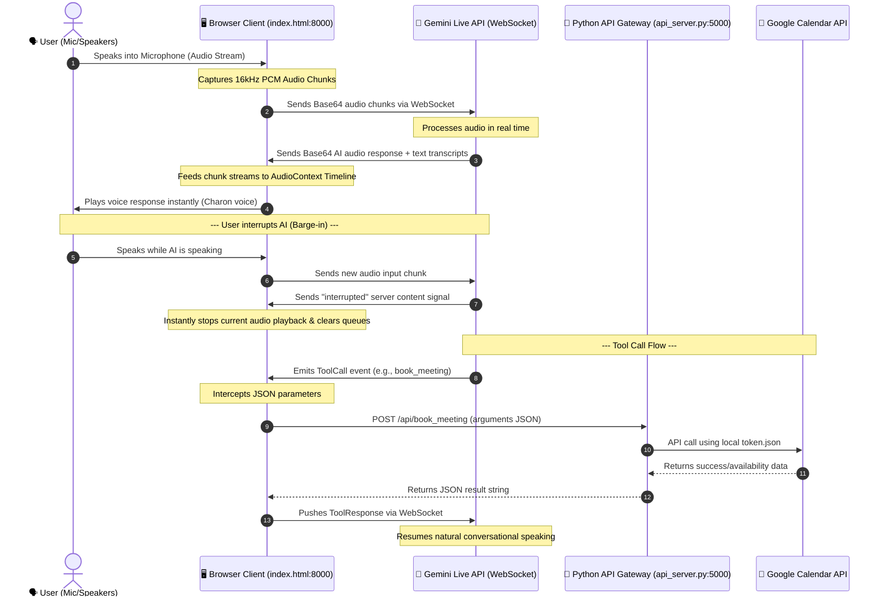

# 🎙️ NovaVoice AI — Architectural Deep Dive & Project Explanation

NovaVoice is a production-grade, ultra-low latency, real-time conversational AI voice platform. It bridges Google's cutting-edge **Gemini Live API** (bidirectional streaming WebSocket service) with a local python microservice to check availability and book meetings autonomously on Google Calendar.

---

## 🗺️ High-Level Visual Architecture



---

## 💡 What This Project Is About & What It Does

From a **non-technical perspective**, NovaVoice acts like a human receptionist or executive assistant. Instead of typing back and forth, you simply click the microphone button, talk naturally, and say:
> *"Hey Charon, check if I'm free tomorrow afternoon, and book a sync with John if there are no conflicts."*

The assistant responds instantly in a realistic human voice, searches your Google Calendar, double-checks if you have existing conflicts, schedules the appointment, and tells you what it did—all within a couple of seconds.

---

## 🛠️ The Modular Infrastructure & Codebases

The project is structured into three clean layers to maximize security, speed, and platform compatibility:

1. **The Interactive UI Layer ([index.html](file:///c:/Users/rohit/OneDrive/Desktop/voice_ai_agents_using-Gemini_live_api/index.html))**
   * Serves on port `8000`.
   * Displays a glassmorphic user dashboard featuring a gorgeous dynamic particle canvas background.
   * Leverages browser APIs to capture raw microphone input, handle continuous bidirectional socket streaming, render a visualizer orb, print real-time transcripts, and play synthesized voice responses.
   * **Security Design:** The browser connects directly to Gemini. This keeps your private Gemini API Key in the browser's volatile memory; it is never saved to files or sent to your local servers.

2. **The Local API Gateway ([api_server.py](file:///c:/Users/rohit/OneDrive/Desktop/voice_ai_agents_using-Gemini_live_api/api_server.py))**
   * Serves on port `5000` via a Flask microservice.
   * Acts as a trusted local bridge. Since Google Calendar authorization tokens (`token.json`) and client secret variables should never be exposed in a public-facing browser client, this backend handles the secure API calls on behalf of the frontend.

3. **The Google Calendar integration ([calendar_tool.py](file:///c:/Users/rohit/OneDrive/Desktop/voice_ai_agents_using-Gemini_live_api/calendar_tool.py))**
   * Houses the core automation functions: [check_availability](file:///c:/Users/rohit/OneDrive/Desktop/voice_ai_agents_using-Gemini_live_api/calendar_tool.py#L15) and [book_meeting](file:///c:/Users/rohit/OneDrive/Desktop/voice_ai_agents_using-Gemini_live_api/calendar_tool.py#L59).
   * Parses time formats cleanly across timezones and makes authenticated requests to Google's calendar endpoints.
   * **OAuth Auto-Refresh:** Dynamically monitors when your login credentials expire, utilizes the `refresh_token` to retrieve a fresh token in the background, and updates [token.json](file:///c:/Users/rohit/OneDrive/Desktop/voice_ai_agents_using-Gemini_live_api/token.json) silently.

4. **The Setup Authentication Server ([auth_server.py](file:///c:/Users/rohit/OneDrive/Desktop/voice_ai_agents_using-Gemini_live_api/auth_server.py))**
   * A configuration utility that runs once to perform the standard Google OAuth login redirect flow and generate the offline credentials.

---

## ⚡ How it Achieves Zero/Low Latency & Real-Time Performance

Traditional voice assistants use **Cascaded TTS/STT pipelines**:
1. User speaks -> wait for audio to end.
2. Send audio to STT (Speech-to-Text) -> wait to receive complete text.
3. Send text to LLM -> wait to generate complete text answer.
4. Send text to TTS (Text-to-Speech) -> wait to generate complete audio file.
5. Play audio.
*This approach results in a painful **3 to 8 second delay** before the assistant starts speaking.*

NovaVoice circumvents this entirely to achieve **sub-second latency** using three key architectural patterns:

### 1. Bidirectional WebSocket Streaming (Gemini Live API)
Instead of sending complete audio blocks, the client and Gemini maintain a persistent, full-duplex WebSocket connection (`wss://generativelanguage.googleapis.com/...`). 
* **Input Pipeline:** The microphone stream is continuously sliced into tiny chunk buffers of float data, downsampled to **16kHz 16-bit Mono PCM**, converted to base64, and pushed up to Google over the socket *while you are still speaking*.
* **Output Pipeline:** Gemini begins streaming raw audio back *within milliseconds of you finishing your sentence*. You don't have to wait for the complete answer; it stream-plays chunks as they arrive.

### 2. Precise Timeline Scheduling (Web Audio API `AudioContext`)
To prevent clicks, pops, or stutters in a streaming audio context:
* The client decodes base64 audio chunks back into float data arrays.
* Rather than playing them using standard HTML5 audio players (which suffer from buffer-start latency), it directly creates buffer sources on a single, continuous, highly precise Web Audio `AudioContext`.
* It uses a queue timer (`nextPlayTime = Math.max(audioContext.currentTime, nextPlayTime)`) to schedule each chunk *exactly* at the boundary of the previous chunk. This ensures the synthetic voice is completely fluid and gap-free.

### 3. Active Interruption and "Barge-in"
A critical challenge in low-latency voice applications is stopping the agent when the user starts speaking over it. 
* When the user talks, the microphone input is immediately transmitted over the WebSocket.
* Gemini identifies the user's vocal overlay and instantly emits a `serverContent` payload with an `interrupted: true` flag.
* The browser client intercepts this flag and immediately executes:
  ```javascript
  activeSources.forEach(source => { try { source.stop(); } catch (e) {} });
  activeSources = [];
  nextPlayTime = audioContext.currentTime;
  ```
  This immediately cuts off the agent's playback, wipes the playback queue, and aligns the scheduler to the current time, making the agent feel alert and responsive.

### 4. Client-Mediated Tool Execution (Function Calling)
When Gemini determines it needs to search or write to your calendar:
1. It sends a `toolCall` JSON event down the WebSocket containing parameters (e.g. `{ "date": "2026-08-10T00:00:00+05:30" }`).
2. The browser's WebSocket reader catches this payload, skips text output, and makes a rapid local asynchronous fetch request (`http://127.0.0.1:5000/api/...`).
3. Because the Flask server and calendar tool logic run locally, this round-trip takes milliseconds.
4. The local result is immediately packaged into a `toolResponse` JSON and fired back over the existing WebSocket to Gemini, which synthesizes the verbal response immediately.
